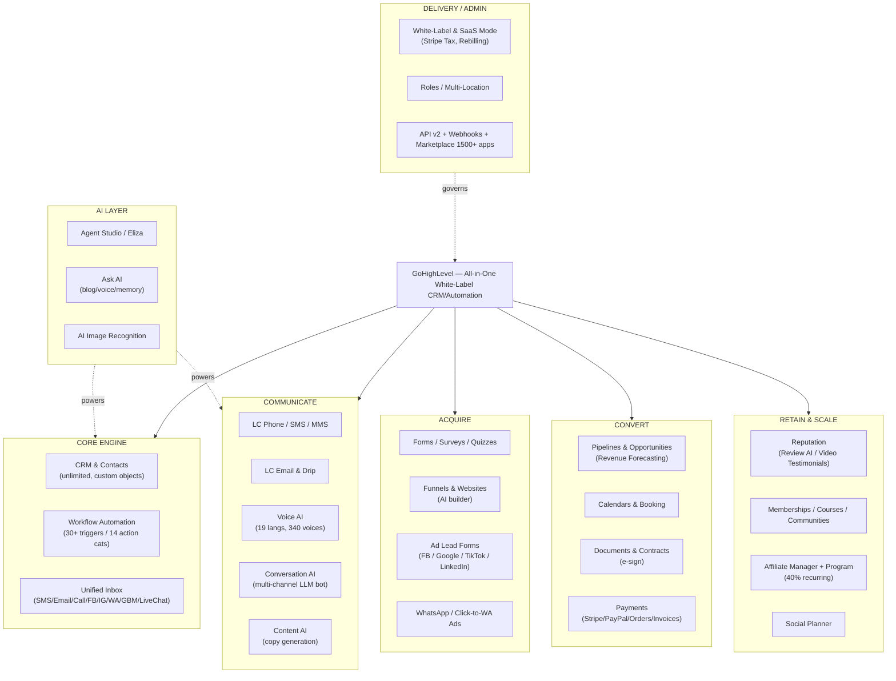
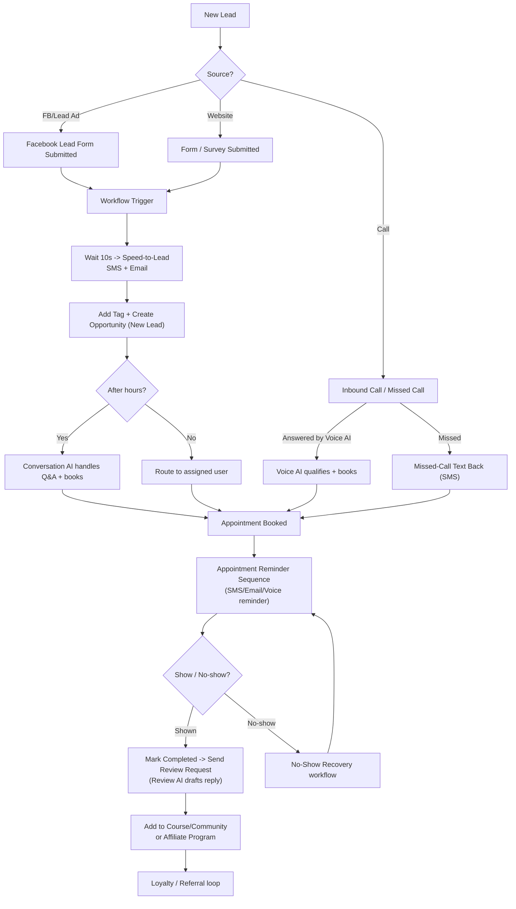

# GoHighLevel — Feature & Automation Flowchart (Mermaid)

Render this with any Mermaid viewer (GitHub, VS Code Mermaid preview, mermaid.live).

## A. Platform Architecture (modules -> sub-features)

## B. Lead Journey (a real automation flow)

